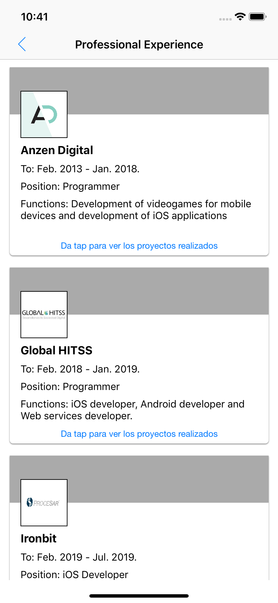

# CVChallegeG
My CV

Application objective:

Show an application that allows you to see your CV according to the information contained in the Web Services.

Architecture pattern used:

The architecture pattern that was used was MVVM. For each UIViewController there is a ViewModel class that implements a protocol. The bindings of the ViewModel with the UIViewController are done through observer's attributes using "didSet".

Tests:

The tests of the services are tested by calling the methods of the class "ServiceManager", an instance of that class is declared and the method that makes the request to the service is called. Later, if the answer is satisfactory, by means of a closure the answer is caught where it can be satisfactory or erroneous.

Screenshots:

Main screen:

Experience Professional screen:

Projects Screen:

